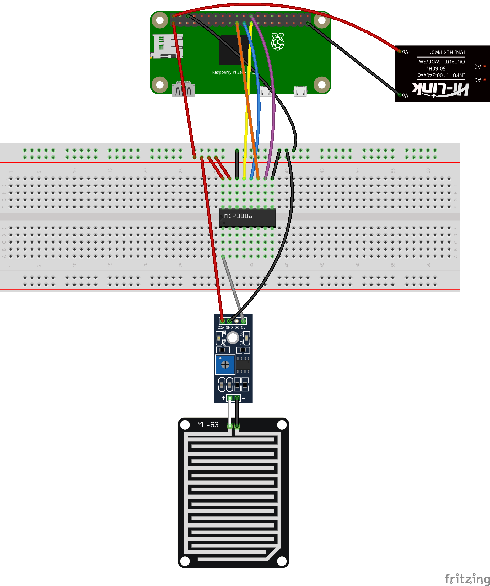

# raspberryRainSensor
Api rest to manager a rain sensor.

## Description
Api rest to get if weather is raining.
Use a microchip MCP3008-I/P to use analog pin from raspberry pi.

## Schema



## Deploy
Follow this steps:

```shell
make docker-exec-builder
```
Inside the builder container:
```shell
 root@a0eabc895cec:/app# make build
```
And, again, outside the container,
```shell
make deploy
```